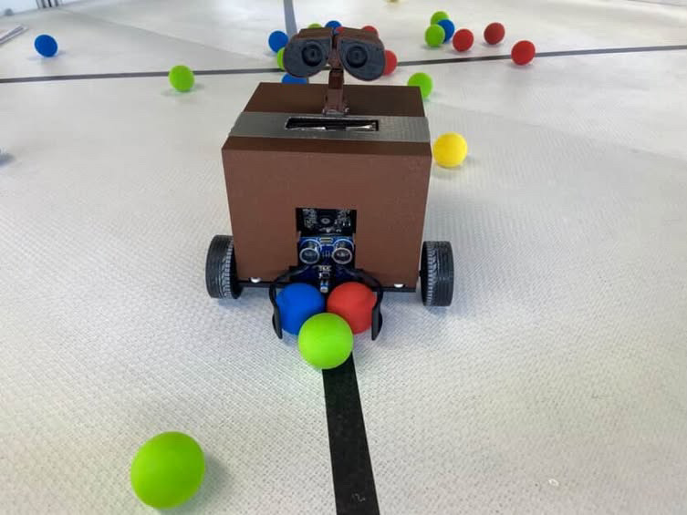
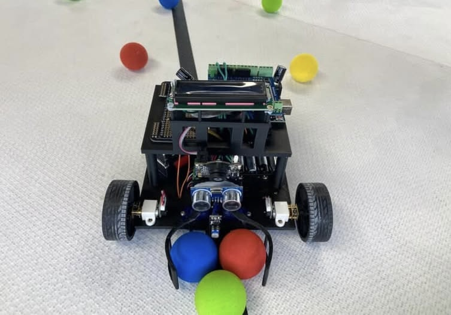
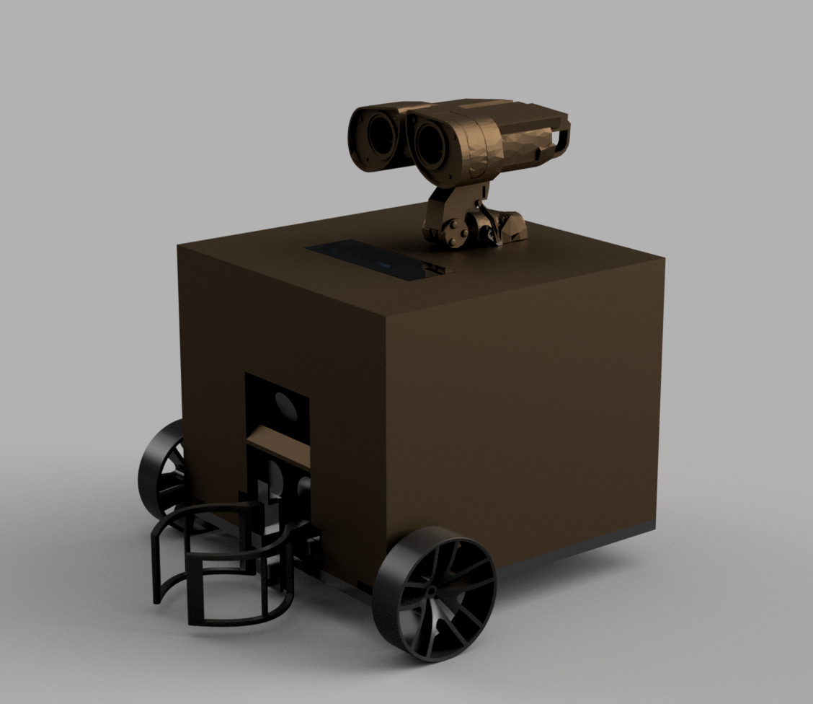
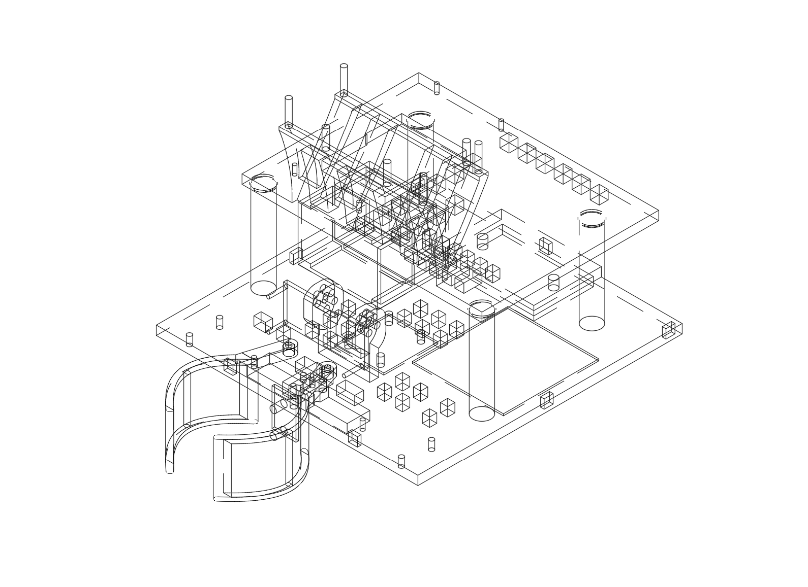

# WALL-F Waste Sorting Robot

WALL-F is an autonomous waste-sorting robot built for the ELEC stream of UNSW DESN1000. The robot was designed to identify, collect, and deposit coloured balls representing different plastic waste categories inside a competition arena.

**Final testing result:** WALL-F placed **2nd out of 30 teams**, completing **16 successful ball deposits in 10 minutes**. The robot deposited balls in the correct RGB order and earned a **High Distinction** result.

## Overview

WALL-F combines colour-based vision, differential drive navigation, obstacle handling, and a servo-actuated clamp to complete repeated collection cycles. The robot first logs its home base colour, then searches the arena for red, green, and blue target balls in sequence. After capturing a ball, it returns to the logged base and deposits it before continuing the next cycle.

The final build used a two-level PLA chassis, a removable WALL-E-inspired shell, a PixyCam 2.1 for colour tracking, an ultrasonic sensor for obstacle detection, and an IR sensor inside the clamp for capture confirmation.

## Final Build

| Completed robot | Internal layout |
| --- | --- |
|  |  |

| Concept render | No-shell chassis CAD |
| --- | --- |
|  |  |

## Electrical Schematic

The final circuit schematic is included as a PNG preview and a PDF reference extracted from the submitted report.


- [Schematic PNG](hardware/schematic/wall-f-schematic.png)
- [Schematic PDF reference](hardware/schematic/wall-f-schematic-from-report-page.pdf)
- [Wiring and pin map](wiring.md)

## Main Hardware

- Arduino Uno controller
- PixyCam 2.1 colour camera
- HC-SR04 ultrasonic distance sensor
- TCRT5000 IR sensor for clamp capture detection
- MKRVRS dual-channel motor driver
- Two N20 geared DC motors
- Two FS90MG servo motors
- 16x2 I2C LCD display
- Dual-level PLA chassis with a front clamp and rear caster wheel

## Design Documentation

The main design details are split across the following files:

- [design-overview.md](design-overview.md) presents the robot's mechanical and electrical design in a report-style format.
- [waste-sorting-algorithm.md](waste-sorting-algorithm.md) explains the implemented mission flow in the final Arduino code.
- [wiring.md](wiring.md) documents the final pin map, power rails, and schematic.
- [calibration/](calibration/) contains placeholder sketches for re-measuring hardware-dependent constants.
- [ELEC_FinalReport_TeamC1.pdf](ELEC_FinalReport_TeamC1.pdf) contains the submitted final report.

## Repository Layout

```text
wall-f/
+-- README.md
+-- ELEC_FinalReport_TeamC1.pdf
+-- design-overview.md
+-- waste-sorting-algorithm.md
+-- wiring.md
+-- finalcode/
|   +-- FINALTESTING/
|       +-- FINALTESTING.ino
+-- calibration/
|   +-- servo-clamp-calibration/
|   +-- motor-turn-calibration/
|   +-- ultrasonic-distance-test/
|   +-- ir-clamp-test/
|   +-- pixy-signature-check/
|   +-- base-return-calibration/
+-- hardware/
|   +-- schematic/
|   +-- kicad/
+-- assets/
+-- report/
```

## Final Code

The final competition sketch is located at:

```text
finalcode/FINALTESTING/FINALTESTING.ino
```

The folder name matches the `.ino` file name so it can be opened directly in the Arduino IDE.

## Calibration Note

The final sketch contains the values used during the competition run. The calibration sketches use `xxxx` placeholders where values should be re-measured for a rebuilt robot, different batteries, surface friction, motor variance, or camera mounting angle.
