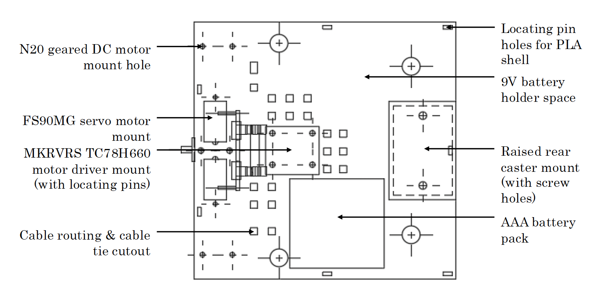
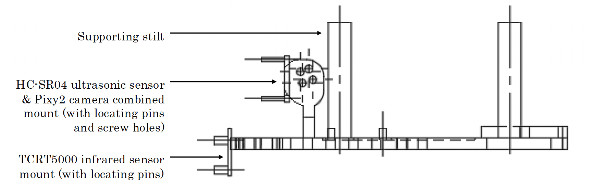
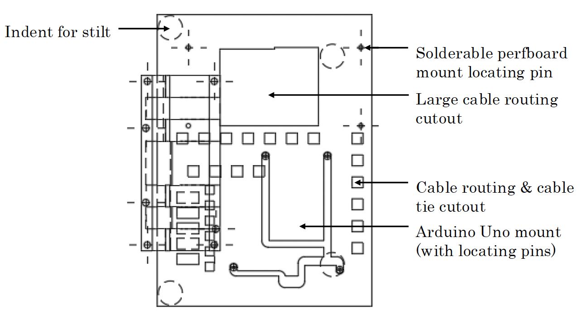
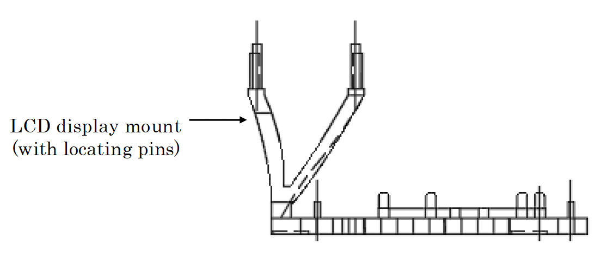
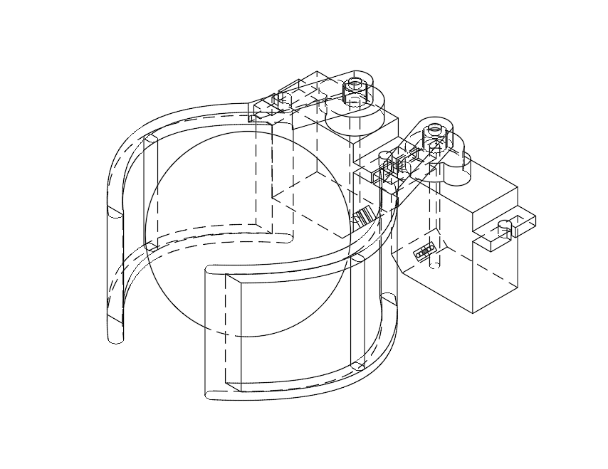
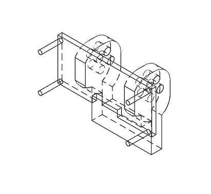
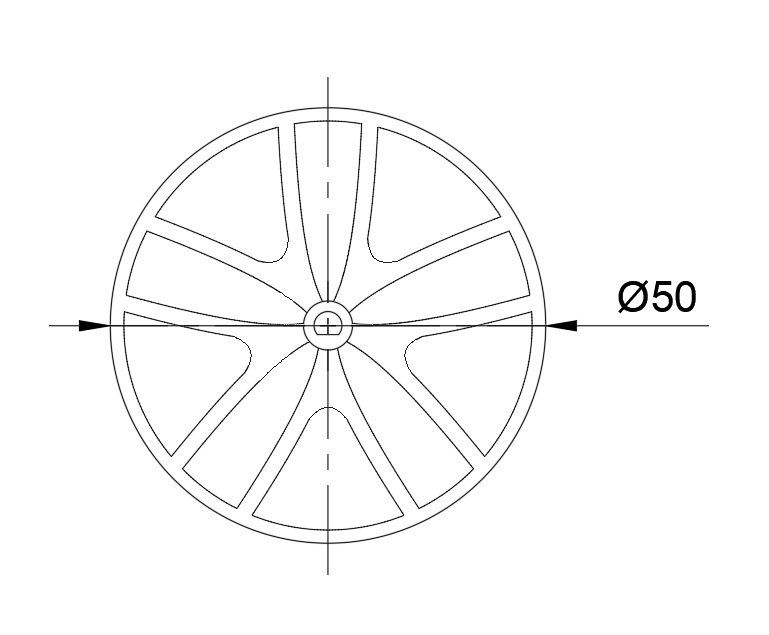
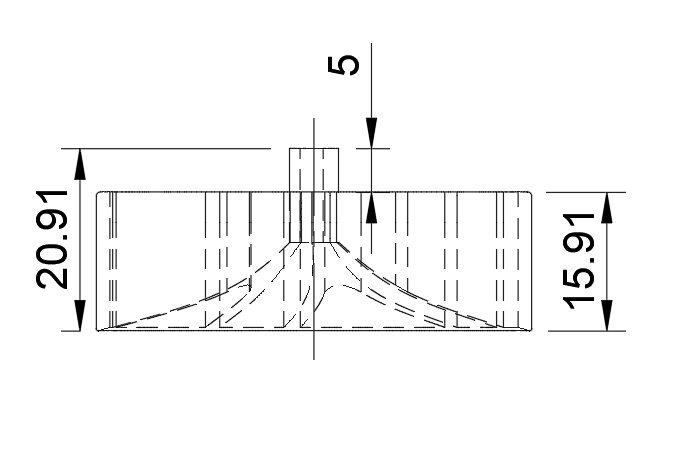
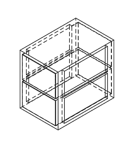

# WALL-F Design Overview

This overview summarises the final WALL-F waste-sorting robot design using the key figures from the project report and build photos.

## 1. Final Robot

WALL-F was built as a compact autonomous robot for the ELEC stream of UNSW DESN1000. The robot operates inside a defined arena, identifies coloured balls using a PixyCam 2.1, collects them with a front clamp, and returns them to a logged home base.


The completed robot uses a removable outer shell inspired by WALL-E. The shell protects the internal electronics while leaving openings for the LCD, PixyCam, ultrasonic sensor, and front clamp.


## 2. Chassis Architecture

The robot is arranged around a two-level PLA chassis. The lower level carries the drive system, batteries, sensors, clamp, and motor driver. The upper level carries the Arduino Uno, shield, perfboard, and LCD.


The no-shell isometric model shows the internal component layout and the relationship between the clamp, sensor mount, lower chassis, and upper electronics platform.


## 3. Lower Level

The lower level contains the mechanical and power-heavy components: the two front drive motors, wheels, batteries, motor driver, clamp servos, PixyCam, HC-SR04 ultrasonic sensor, and TCRT5000 IR sensor.

| Lower level top view | Lower level side view |
|---|---|
|  |  |

The lower chassis also includes cable routing cutouts and mounting features to keep wiring traceable and reduce movement during operation.

## 4. Upper Level

The upper level carries the main control electronics and user feedback hardware. The LCD is mounted on top so the robot can display its current mission state during testing and operation.

| Upper level top view | Upper level side view |
|---|---|
|  |  |

Separating the control electronics from the lower drive components helped keep the layout compact while preserving access for debugging and maintenance.

## 5. Ball Collection Mechanism

The ball handling subsystem uses two FS90MG servos and a pair of curved clamp arms. The clamp remains open while the robot approaches a target ball, then closes once the TCRT5000 IR sensor detects that a ball has entered the clamp region.



The clamp is intentionally simple: it is shaped around the fixed ball size used in the DESN1000 arena rather than designed as a general-purpose gripper.

## 6. Sensor Mounting

The PixyCam 2.1 and HC-SR04 ultrasonic sensor are mounted together at the front of the robot. The PixyCam tracks coloured balls and base plates, while the ultrasonic sensor detects obstacles in the robot's forward path.



The camera mount angle is calibration-dependent. In the final build, the camera was angled downward so nearby balls, the clamp region, and base plates remained visible during approach.

## 7. Drive And Stability

The robot uses two front drive wheels and a rear caster wheel. Differential drive allows it to move forward, reverse, and turn on the spot.

| Wheel side view | Wheel front view |
|---|---|
|  |  |

Rubber tyres were added to improve traction and turning accuracy compared with bare PLA wheels.

The final design also added a dedicated battery mount to stop the 9 V batteries shifting during movement, which improved steering consistency.



## 8. Electrical System

The final electrical design uses separate supplies for the Arduino, motors, and servos, with a shared common ground. This reduced brownouts and improved reliability during motor and servo current spikes.


The final circuit used:

- 9 V alkaline battery for Arduino input.
- 9 V alkaline battery for the MKRVRS motor rail.
- 4xAAA alkaline battery pack for the servo rail.
- Common ground between all modules.
- 1000 uF capacitors for transient smoothing.

The detailed pin map and power notes are documented in `wiring.md`.

## 9. Software Integration

The final Arduino sketch coordinates all subsystems through a repeated mission loop:

```text
Log base -> search target -> centre -> chase -> clamp -> return -> deposit -> repeat
```

The robot collects balls in the strict order:

```text
RED -> GREEN -> BLUE -> repeat
```

Further details are documented in `waste-sorting-algorithm.md`.

## 10. Final Testing Outcome

During the 10-minute final testing run, WALL-F completed 16 successful ball deposits and placed 2nd overall. The result showed that the combined vision, clamp, obstacle handling, and return-to-base behaviours were reliable enough for repeated autonomous sorting cycles under competition conditions.

