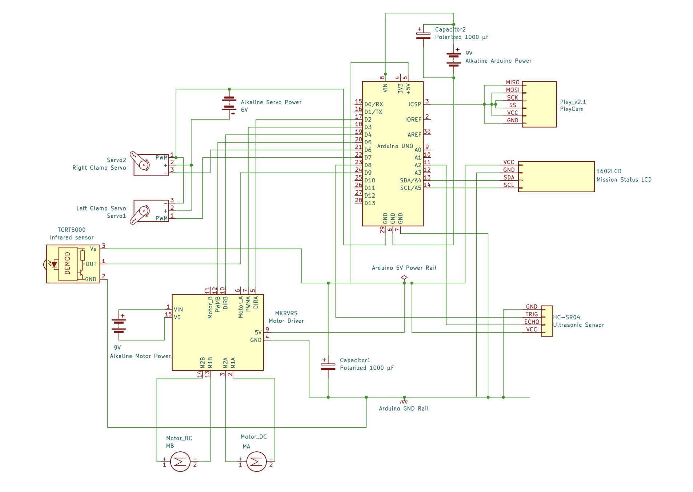

# WALL-F Electrical Schematic

This folder contains the final WALL-F circuit schematic used by the wiring documentation.

## Preview

## Files

- `wall-f-schematic.png` - PNG schematic preview embedded in the repo documentation.
- `wall-f-schematic-from-report-page.pdf` - PDF reference extracted from the submitted final report.

Editable KiCad project files will be added under `../kicad/` once they are exported and checked.
